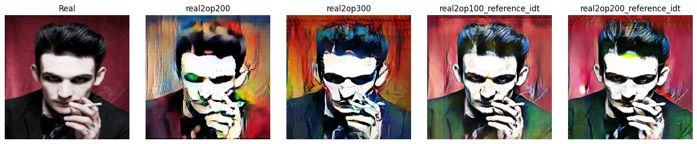
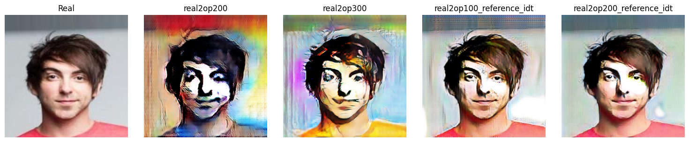
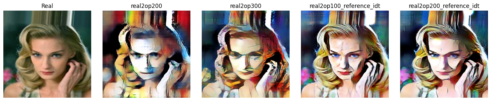

# CycleGAN implementation with Variational Autoencoders for Neural Style Transfer

This repository is a fork of <a href="https://github.com/junyanz/pytorch-CycleGAN-and-pix2pix">pytorch-CycleGAN-and-pix2pix</a>, find all of the aknowledgments at the bottom of this readme.
### NST from human pictures to OnePiece




This project aims at transferring style from OnePiece's anime images to real human pictures. This particular Deep Learning task was carried on using a particular architecture, the CycleGAN (Generative Adversarial Networks), which uses two generators and two discriminators to transfer from style A to style B and back (B to A). It also introduces the **Cycle Consistency Loss** concept, that ensures that a style transfer is consistent because it can be reversed.

Variational AutoEncoders (VAE) have been chosen as Generator networks for the CycleGAN.
Discriminator networks are still the ones in the original paper, some 70\*70 PatchGANs, which aim to classify whether 70\*70px overlapping image patches are real or fake.

The experiments that were carried on included differen VAE Networks Architectures, trying to find the one that best fits for this task.

### Codebase

The codebase was kept as similar as possible to the original repostory, leveraging on the existent framework for Data preprocessing, Dataset loading and Model's loading, training and testing management. Actually, the non-CycleGAN-related scripts and models were cleaned out and custom ones were introduced:
- Dataset download and preprocessing [scripts](./data/custom_dataset_nst/);
- Dataset conversion to tensors [script](./iterate_dataset.py);
- [Tensor](./data/tensor_dataset.py) Dataset Loader;
- [VAEs](./models/vae_nets.py) network architectures, in particular four different VAEs were introduced:
  - `VAE1`: a rudimental handmade model based on a CN-based AutoEncoder architecture where Encoder has (Conv+Bn+Activ.funct.) for each layer, default 4 layers of [64,128,256,512] conv. filters. The decoder is basically an inverted encoder plus a final de-convolution and an hyperbolic tangent. The mapping to the latent space is done via two FC hidden layers, and their output passes through a reparametrization function to match a Normal Distribution. This network was not able to train for enough epochs before losses imploded to `NaN`, probably because of it's poor generative capacity.
  - `VAEGAN` was our second try, inspired by an online repository we found (find it in the Acknowledgement and Code), it's similar to the first model but it has Convolutional mapping to the latent space, which resulted in a valid training phase but with scarse final results, probably because of a limit of the simple Convolutional based approach.
  - after reading some papers about goodness of ResNets adapted to VAE,we decided to edit the ResNet generator from the original CycleGAN repository, renaming it `ResnetKVAE`. We added two convolution kernels at the end of the Encoder to get latent mean and variance, then a latent space sampling function using the reparametrization trick and a convolution layer to sample from the latent space distribution to input the Decoder.
  - Finally we tried the VAE-adapted-ResNet from [LukeDitria](https://github.com/LukeDitria/CNN-VAE), but it's massive number of parameters made it quite difficult to train for a considerable number of epochs.

Notice that the actual codebase differs from the original one, so commands or options coming from the original repository may not work here.

For usage details, see the [tips](./docs/tips.md)

### Usage
Look at the [CycleGAN.ipynb](./CycleGAN.ipynb) notebook to see how to train the VAEs.

### Acknowledgments
All credits go to the original CycleGAN and Pix2Pix creators: find out more  <a href="https://github.com/junyanz/pytorch-CycleGAN-and-pix2pix">pytorch-CycleGAN-and-pix2pix</a>. If you use this code for your research, please cite:
```
@inproceedings{CycleGAN2017,
  title={Unpaired Image-to-Image Translation using Cycle-Consistent Adversarial Networks},
  author={Zhu, Jun-Yan and Park, Taesung and Isola, Phillip and Efros, Alexei A},
  booktitle={Computer Vision (ICCV), 2017 IEEE International Conference on},
  year={2017}
}


@inproceedings{isola2017image,
  title={Image-to-Image Translation with Conditional Adversarial Networks},
  author={Isola, Phillip and Zhu, Jun-Yan and Zhou, Tinghui and Efros, Alexei A},
  booktitle={Computer Vision and Pattern Recognition (CVPR), 2017 IEEE Conference on},
  year={2017}
}
```
Also, variant models that you can find in this code were inspired by:
[Variational AutoEncoders (VAE) with PyTorch - Alexander Van de Kleut](https://avandekleut.github.io/vae/), [podgorskiy/VAE](https://github.com/podgorskiy/VAE), [AntixK/PyTorch-VAe](https://github.com/AntixK/PyTorch-VAe) for giving general overview and ideas of how VAE's architectures are implemented
[ST-VAE](https://github.com/Holmes-Alan/ST-VAE) for an example of how VAEs suit for Style Transfer
We also tried [CycleGAN-VAE-for-reid](https://github.com/xr-Yang/CycleGAN-VAE-for-reid)'s architecture and it gave us many ideas on how to make our own.
Finally, we got into ResNet and VAEs together and took ispiration from [LukeDitria/CNN-VAE](https://github.com/LukeDitria/CNN-VAE).